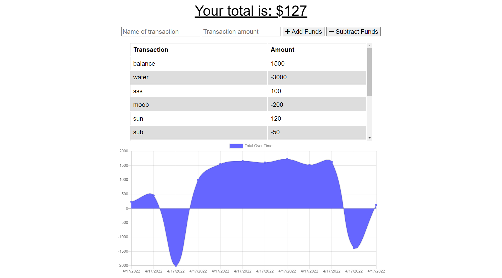

# Buget-Tracker

## Description
The purpose of this application is to have an application that would track your budget.

## Table of Contents

* [Installation](#installation)
* [Usage](#usage)
* [Credits](#credits)
* [License](#license)

## Installation

The project is viewable at the project's heroku page.

URL of deployed application: https://shrouded-ridge-71285.herokuapp.com/

## Usage
This tracker allows you to keep track of funds. It is responsive even when it is offline. This application can also be downloaded.

## Credits

[Armando Cuellar](https://github.com/armcuellar) 

## License

Licencsed under [MIT License](LICENSE)